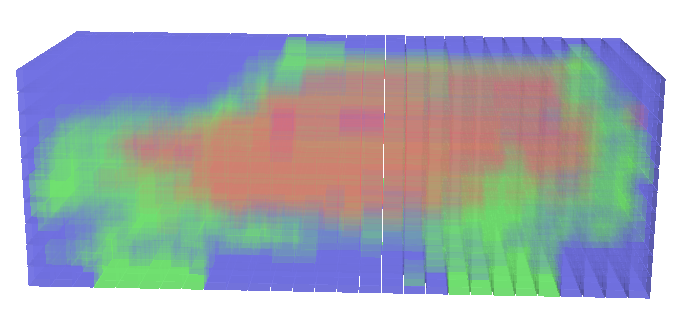
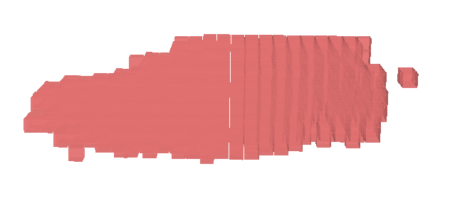
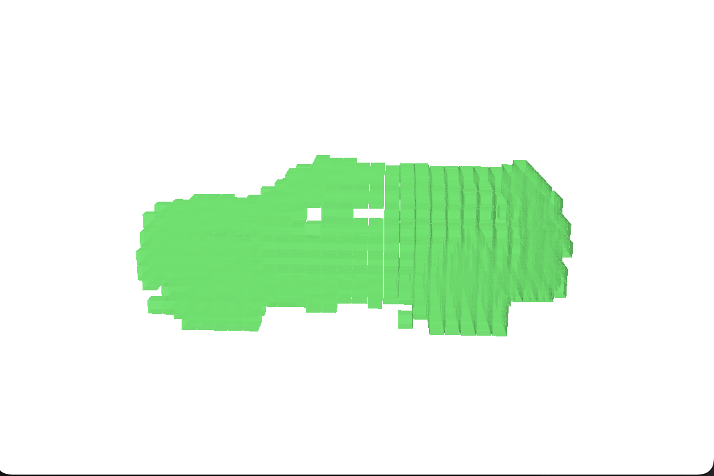
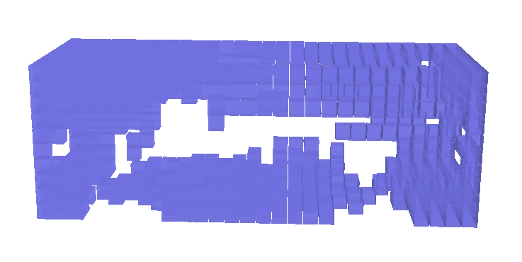

# Towards Flexible 3D Perception: Object-Centric Occupancy Completion Augments 3D Object Detection
[](https://arxiv.org/abs/2412.05154)


This repository contains the code for our NeurIPS 2024 paper: “Towards Flexible 3D Perception: Object-Centric Occupancy Completion Augments 3D Object Detection”.

## Updates
- `24/12/15` We've released the codes for annotating and visualizing the object-centric occupancy.


### To-Dos:
+	~~Release codes for data generation.~~
+	Release codes for training and evaluation.

## Setup
Please follow the [SST setup instructions](https://github.com/tusen-ai/SST/blob/main/docs/overall_instructions.md) to configure the environment.
For details on specific version requirements, refer to this [GitHub issue](https://github.com/tusen-ai/SST/issues/117#issuecomment-1608827756).

Please install Mayavi for occupancy visualization.

```
pip install mayavi

pip install PyQt5
```

## Annotating the Object-Centric Occupancy Dataset


1. Follow [this instruction from MMDetection3D](https://mmdetection3d.readthedocs.io/en/v0.15.0/data_preparation.html#waymo) to download and prepare Waymo Open Dataset.
2. Run the following command to extract raw waymo frame data.
	```
	python tools/create_data.py waymo_raw --root-path ./data/waymo/ --out-dir ./data/waymo/ --workers 64 --extra-tag waymo
	```
3. Following [this instruction from CTRL](https://github.com/tusen-ai/SST/blob/main/docs/CTRL_instructions.md#step-1-generate-train_gtbin-once-for-all-waymo-bin-format) to generate `train_gt.bin` for the training split.
4. Start annotation:
	```
	python tools/occ/occ_annotate.py --bin-path ./data/waymo/waymo_format/train_gt.bin --workers 32 --ngpus 8 --voxel-size 0.2 --data-root ./data/waymo/ --out-dir ./work_dirs/occ_annotate/waymo_occ_gt --split training
	```
	```
	python tools/occ/occ_annotate.py --bin-path ./data/waymo/waymo_format/gt.bin --workers 32 --ngpus 8 --voxel-size 0.2 --data-root ./data/waymo/ --out-dir ./work_dirs/occ_annotate/waymo_occ_gt --split validation
	```
## Visualization
After finishing the annotation, you can use the following command for visualization.
```
python tools/occ/visualizae_occ.py --occ-file {PATH_TO_NPZ}
``` 

A mayavi window will show up when running this command. 
-  Red voxels are unknown.
-  green voxels are occupied.
-  blue voxels are free.

You can use the UI to hide/show components.  

<p float="left">
  
   
  
  
</p>

## Citation
Consider citing our work if you find this project useful in your research.
```
@article{zheng2024towards,
  title={Towards Flexible 3D Perception: Object-Centric Occupancy Completion Augments 3D Object Detection},
  author={Zheng, Chaoda and Wang, Feng and Wang, Naiyan and Cui, Shuguang and Li, Zhen},
  booktitle={NeurIPS},
  year={2024}
}
```

## Acknowledgment
+ This repo is heavily built upon [SST](https://github.com/tusen-ai/SST).


