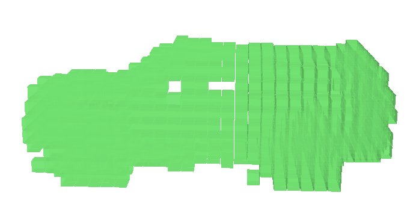

# Towards Flexible 3D Perception: Object-Centric Occupancy Completion Augments 3D Object Detection
[](https://arxiv.org/abs/2412.05154)


This repository contains the code for our NeurIPS 2024 paper: “Towards Flexible 3D Perception: Object-Centric Occupancy Completion Augments 3D Object Detection”.

## Updates
- `25/04/20` We've released the codes for training and testing.
- `24/12/15` We've released the codes for annotating and visualizing the object-centric occupancy.


### To-Dos:
+	~~Release codes for data generation.~~
+	~~Release codes for training and evaluation.~~

## Setup
Please follow the [SST setup instructions](https://github.com/tusen-ai/SST/blob/main/docs/overall_instructions.md) to configure the environment.
For details on specific version requirements, refer to this [GitHub issue](https://github.com/tusen-ai/SST/issues/117#issuecomment-1608827756).

Please install Mayavi for occupancy visualization.

```
pip install mayavi

pip install PyQt5
```

## Annotating the Object-Centric Occupancy Dataset


1. Follow [this instruction from MMDetection3D](https://mmdetection3d.readthedocs.io/en/v0.15.0/data_preparation.html#waymo) to download and prepare Waymo Open Dataset.
2. Run the following command to extract raw waymo frame data.
	```
	python tools/create_data.py waymo_raw --root-path ./data/waymo/ --out-dir ./data/waymo/ --workers 64 --extra-tag waymo
	```
3. Following [this instruction from CTRL](https://github.com/tusen-ai/SST/blob/main/docs/CTRL_instructions.md#step-1-generate-train_gtbin-once-for-all-waymo-bin-format) to generate `train_gt.bin` for the training split.
4. Start annotation:
	```
	python tools/occ/occ_annotate.py --bin-path ./data/waymo/waymo_format/train_gt.bin --workers 32 --ngpus 8 --voxel-size 0.2 --data-root ./data/waymo/ --out-dir ./work_dirs/occ_annotate/waymo_occ_gt --split training
	```
	```
	python tools/occ/occ_annotate.py --bin-path ./data/waymo/waymo_format/gt.bin --workers 32 --ngpus 8 --voxel-size 0.2 --data-root ./data/waymo/ --out-dir ./work_dirs/occ_annotate/waymo_occ_gt --split validation
	```
## Visualization
After finishing the annotation, you can use the following command for visualization.
```
python tools/occ/visualizae_occ.py --occ-file {PATH_TO_NPZ}
``` 

A mayavi window will show up when running this command. 
-  Red voxels are unknown.
-  green voxels are occupied.
-  blue voxels are free.

You can use the UI to hide/show components.  

<p float="left">
  
   
  
  
</p>

## Training
### Tracklet Data Preparation
As a second-stage detector, our method needs tracklet data for training.
We basically follow [CTRL instructions](https://github.com/tusen-ai/SST/blob/main/docs/CTRL_instructions.md) for the data preparation.

Below is the step-by-step guide.

1. Generate GT tracklet data: 
	```shell
	python ./tools/ctrl/generate_train_gt_bin.py
	```
2. Generate detection results.
Run your preferred detector on training and validation set to generate 'results_train.bin' and 'results_val.bin' separately.

3. Generate tracking results from the detections above. Here we use [ImmortalTracker](https://github.com/Abyssaledge/ImmortalTracker-for-CTRL). 

	First install ImmortalTracker.
	```shell
	cd ..
	git clone https://github.com/Abyssaledge/ImmortalTracker-for-CTRL.git
	cd ImmortalTracker-for-CTRL
	pip install -r requirements.txt
	```

	Then prepare the data and generate the tracking results. Please do the following separately for the training and validation splits.
	```shell
	bash preparedata/waymo/waymo_preparedata.sh  /<path to WOD>/waymo

	bash preparedata/waymo/waymo_convert_detection.sh <path to detection results>/detection_result.bin <detection name>

	```
	Change the `det_name` in `run_mot.sh` to `<detection name>` you set above. Then run:
	```
	sh run_mot.sh
	```
	If everything works fine, you will get generated `.bin` files under `mot_results/waymo/` directory.
	
4.  Generate track input for training using the `.bin` file generated by ImmortalTracker.
	
	First change the `bin_path` and `split` in `./tools/ctrl/data_configs/fsd_base_vehicle.yaml` to match your need. Then run:
	```
	python ./tools/ctrl/generate_track_input.py ./tools/ctrl/data_configs/fsd_base_vehicle.yaml --process 8
	```
5. Assign candidates GT tracks. This step assign gt candidates to each predicted tracklet.
	```
	python ./tools/ctrl/generate_candidates.py ./tools/ctrl/data_configs/fsd_base_vehicle.yaml --process 8
	```
6. Begin training: 
	```
	bash tools/dist_train.sh configs/ococc/ococcnet.py 8 --no-validate
	```
	Please modified the config file `ococcnet.py` accordingly to ensure correct data location.

## EVALUATION
We use the val data generated in above steps to do the evaluation.

```
bash tools/dist_test.sh configs/ococc/ococcnet.py ./work_dirs/ococcnet/latest.pth 8 --options "pklfile_prefix=./work_dirs/ococcnet/result_iou_fsd"  --eval iou waymo
```

If everything works fine, you'll get something like:
```
OBJECT_TYPE_TYPE_VEHICLE_LEVEL_1: [mAP 0.828851] [mAPH 0.824125]
OBJECT_TYPE_TYPE_VEHICLE_LEVEL_2: [mAP 0.748815] [mAPH 0.744321]
OBJECT_TYPE_TYPE_PEDESTRIAN_LEVEL_1: [mAP 0] [mAPH 0]
OBJECT_TYPE_TYPE_PEDESTRIAN_LEVEL_2: [mAP 0] [mAPH 0]
OBJECT_TYPE_TYPE_SIGN_LEVEL_1: [mAP 0] [mAPH 0]
OBJECT_TYPE_TYPE_SIGN_LEVEL_2: [mAP 0] [mAPH 0]
OBJECT_TYPE_TYPE_CYCLIST_LEVEL_1: [mAP 0] [mAPH 0]
OBJECT_TYPE_TYPE_CYCLIST_LEVEL_2: [mAP 0] [mAPH 0]
RANGE_TYPE_VEHICLE_[0, 30)_LEVEL_1: [mAP 0.936912] [mAPH 0.933162]
RANGE_TYPE_VEHICLE_[0, 30)_LEVEL_2: [mAP 0.925776] [mAPH 0.922057]
RANGE_TYPE_VEHICLE_[30, 50)_LEVEL_1: [mAP 0.820873] [mAPH 0.815926]
RANGE_TYPE_VEHICLE_[30, 50)_LEVEL_2: [mAP 0.759347] [mAPH 0.754594]
RANGE_TYPE_VEHICLE_[50, +inf)_LEVEL_1: [mAP 0.670598] [mAPH 0.662612]
RANGE_TYPE_VEHICLE_[50, +inf)_LEVEL_2: [mAP 0.538431] [mAPH 0.531455]
RANGE_TYPE_PEDESTRIAN_[0, 30)_LEVEL_1: [mAP 0] [mAPH 0]
RANGE_TYPE_PEDESTRIAN_[0, 30)_LEVEL_2: [mAP 0] [mAPH 0]
RANGE_TYPE_PEDESTRIAN_[30, 50)_LEVEL_1: [mAP 0] [mAPH 0]
RANGE_TYPE_PEDESTRIAN_[30, 50)_LEVEL_2: [mAP 0] [mAPH 0]
RANGE_TYPE_PEDESTRIAN_[50, +inf)_LEVEL_1: [mAP 0] [mAPH 0]
RANGE_TYPE_PEDESTRIAN_[50, +inf)_LEVEL_2: [mAP 0] [mAPH 0]
RANGE_TYPE_SIGN_[0, 30)_LEVEL_1: [mAP 0] [mAPH 0]
RANGE_TYPE_SIGN_[0, 30)_LEVEL_2: [mAP 0] [mAPH 0]
RANGE_TYPE_SIGN_[30, 50)_LEVEL_1: [mAP 0] [mAPH 0]
RANGE_TYPE_SIGN_[30, 50)_LEVEL_2: [mAP 0] [mAPH 0]
RANGE_TYPE_SIGN_[50, +inf)_LEVEL_1: [mAP 0] [mAPH 0]
RANGE_TYPE_SIGN_[50, +inf)_LEVEL_2: [mAP 0] [mAPH 0]
RANGE_TYPE_CYCLIST_[0, 30)_LEVEL_1: [mAP 0] [mAPH 0]
RANGE_TYPE_CYCLIST_[0, 30)_LEVEL_2: [mAP 0] [mAPH 0]
RANGE_TYPE_CYCLIST_[30, 50)_LEVEL_1: [mAP 0] [mAPH 0]
RANGE_TYPE_CYCLIST_[30, 50)_LEVEL_2: [mAP 0] [mAPH 0]
RANGE_TYPE_CYCLIST_[50, +inf)_LEVEL_1: [mAP 0] [mAPH 0]
RANGE_TYPE_CYCLIST_[50, +inf)_LEVEL_2: [mAP 0] [mAPH 0]

 Overall iou: 0.6280632615089417,
mIoU (track): 0.544739305973053
mIoU (box): 0.6181023457963372

small box iou: 0.6230124321599789
medium box iou: 0.5619384277514495
large box iou: 0.417360612967283
```
## Citation
Consider citing our work if you find this project useful in your research.
```
@article{zheng2024towards,
  title={Towards Flexible 3D Perception: Object-Centric Occupancy Completion Augments 3D Object Detection},
  author={Zheng, Chaoda and Wang, Feng and Wang, Naiyan and Cui, Shuguang and Li, Zhen},
  booktitle={NeurIPS},
  year={2024}
}
```

## Acknowledgment
+ This repo is heavily built upon [SST](https://github.com/tusen-ai/SST).


